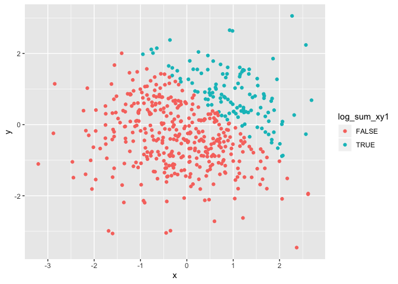
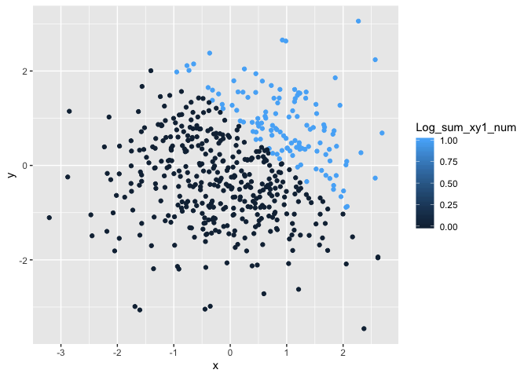
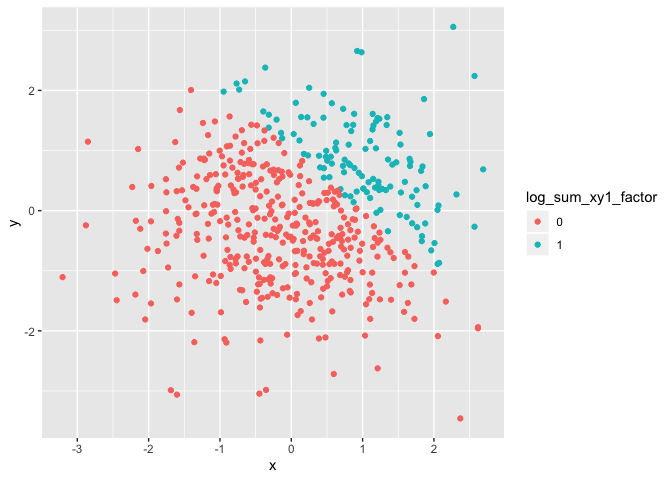

p8105\_hw1\_kd2524-for-Jeff
================
Katherine Dimitropoulou\_UNI\_kd2524
9/20/2019

\#\#\#Problem 1

\#\#Step 1\_Create a data frame comprised of: \#a random sample of size
8 from a standard Normal \#distribution \#a logical vector indicating
whether elements of the sample are greater than 0 \#a character vector
of length 8 \#a factor vector of length 8, with 3 different factor
“levels”

\#\#Then compute the means for the variables in the dataset

\#Code Chunk

``` r
Hw1Probl1_df = tibble (
  norm_set = rnorm(8),
  norm_pos = norm_set > 0,
  Question_char = c("Q1", "Q2", "Q3", "Q4", "Q5", "Q6", "Q7", "Q8"),
  Response_factor = factor(c("Agree", "Neutral", "Disagree", "Disagree", "Agree", "Neutral", "Neutral", "Agree"))
)
```

\#Mean of numeric variable mean(pull(Hw1Probl1\_df, norm\_set)) \#Mean
of logical variable mean(pull(Hw1Probl1\_df, norm\_pos)) \#Mean of
character variable mean(pull(Hw1Probl1\_df, Question\_char)) \#Mean of
factor variable mean(pull(Hw1Probl1\_df, Response\_factor))

\#There is no mean for the character and factor variables because they
are not numeric or logical.

\#\#Step 2 \#Use as.numeric function on the variables from
Hw1Probl1\_df. \#Code Chunk

``` r
Hw1Probl1_num_df = tibble(
  norm_set = rnorm(8),
  norm_pos = as.numeric(norm_set > 0),
  Question_char = as.numeric(c("Q1", "Q2", "Q3", "Q4", "Q5", "Q6", "Q7","Q8")),
  Response_factor = as.numeric(factor(c("Agree", "Neutral", "Disagree", "Disagree", "Agree", "Neutral", "Neutral", "Agree")))
)
```

# Step 3 Create a code chunk for the following conversions:

\#conversion of the logical vector to numeric, and multiply the random
sample by the result \#conversion the logical vector to a factor, and
multiply the random sample by the result \#conversion the logical vector
to a factor and then convert the result to numeric, and multiply the
random sample by the result

\#Code Chunk

``` r
Hw1Probl1_convert_df = tibble(
  norm_set = rnorm(8),
  norm_pos_num = as.numeric(norm_set > 0),
  Product1 = norm_set*norm_pos_num,
  norm_pos_factor = as.factor(norm_set > 0),
  Product2 = norm_set*norm_pos_factor,
  norm_pos_factor_num = as.numeric(as.factor(norm_set > 0)),
  Product3 = norm_set*norm_pos_factor_num
)
```

\#\#\#Problem 2

\#\#Step 1 \#Create a data frame comprised of the following:  
\#x: a random sample of size 500 from a standard Normal distribution  
\# y: a random sample of size 500 from a standard Normal distribution  
\# A logical vector indicating whether x + y \> 1  
\#A numeric vector created by coercing the above logical vector  
\#A factor vector created by coercing the above logical vector

``` r
Hw1Probl2_df = tibble(
  x = rnorm(500),
  y = rnorm(500),
  log_sum_xy1 = x + y > 1,
  Log_sum_xy1_num = as.numeric(x + y > 1),
  log_sum_xy1_factor = as.factor(Log_sum_xy1_num)
)
```

## Step 2

\#Write a short description of your vector using inline R code,
including: \#the size of the dataset (using nrow and ncol)
nrow(Hw1Probl2\_df) ncol(Hw1Probl2\_df) \#the mean, median, and standard
deviation of x mean(pull(Hw1Probl2\_df, x)) median(pull(Hw1Probl2\_df,
x)) sd(pull(Hw1Probl2\_df, x)) \#the proportion of cases for which x + y
\> 1 \#Because it is a binary var we can use the mean function for
proportion, mean(pull(Hw1Probl2\_df, Log\_sum\_xy1\_num)) \# NOTE: We
can also use the following for computation of proportions if the
variable is not binary \#sum(pull(Hw1Probl2\_df, Log\_sum\_xy1\_num))
/length(pull(Hw1Probl2\_df, Log\_sum\_xy1\_num))\`.

\#Scatter plot adding color using logical
variable:

``` r
ggplot(Hw1Probl2_df, aes(x = x, y = y, color = log_sum_xy1)) + geom_point()
```

<!-- -->

\#Scatter plot adding color using numeric
variable:

``` r
ggplot(Hw1Probl2_df, aes(x = x, y = y, color = Log_sum_xy1_num)) + geom_point()
```

<!-- -->

\#Scatter plot adding color using factor
variable:

``` r
ggplot(Hw1Probl2_df, aes(x = x, y = y, color = log_sum_xy1_factor)) + geom_point()
```

<!-- -->
